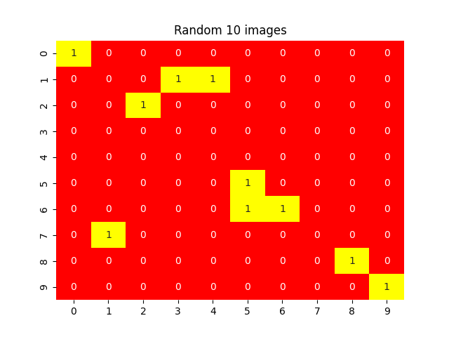

# Dogs Breed Classifier

```sh
S3/dogsClassifier/
├── config
│   └── configs.yaml
├── datum
│   ├── __init__.py
│   └── litdatum.py
├── Dockerfile
├── dogs_dataset
│   ├── train
│   └── validation
├── eval.py
├── infer.py
├── logs
│   ├── chkpoints
│   └── lightning_logs
├── models
│   ├── __init__.py
│   └── litmodel.py
├── README.md
├── requirement.txt
├── train.py
├── .devcontainer
│     └── devcontainer.json
└── utils
    └── utils.py

14 directories, 12 files

```


## devcontainer
```js
{
	"name": "dogsClassifier",
	"build": {
		"context": "..",
		"dockerfile": "../Dockerfile"
	}
}
```

## Train,eval
```python
## Training
trainer.fit(model=model,datamodule=dm)
## Validation
trainer.validate(model,datamodule=dm)
```


## Infer
